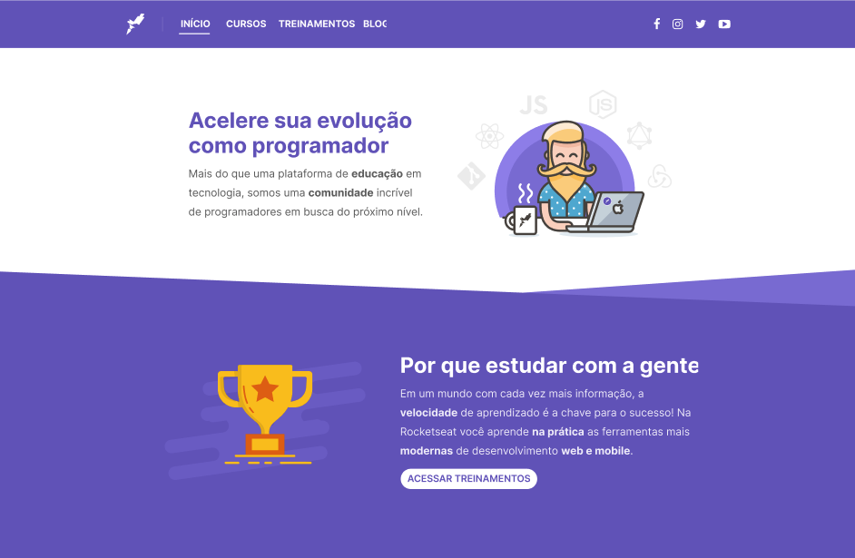

# Rocketseat's Old Website

  

## 🖥️ Project

This is a project developed as a challenge to recreate the Rocketseat's old website using Astro with Tailwind.

## 🚀 Technologies

This project was developed during a live from [Mayk Brito's Youtube Channel](https://www.youtube.com/@MaykBrito) using the following technologies:

- Astro
- HTML
- TailwindCSS

## 🔖 Layout

You can see the project layout
[here](https://www.figma.com/design/JWjeH7VlmwaARcUSSgX8qg/site-novo?node-id=0-1&t=WCrJsjX50SlLYFW6-0).
You must have an account at [Figma](https://www.figma.com)
